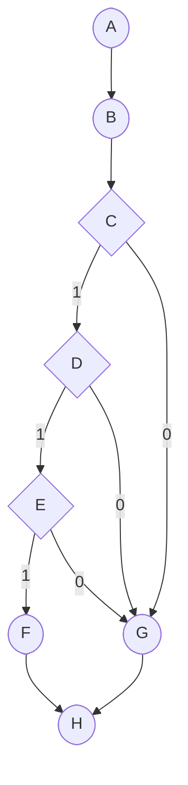

# UXUI - Teste Caixa Branca (parte 1)

## Descrição

Este repositório reúne a análise de teste de caixa branca (estática) aplicada ao código-fonte do projeto, incluindo a construção do grafo de fluxo, cálculo da complexidade ciclomática e identificação dos caminhos básicos de execução.

## Grafo de Fluxo

## Notação de Grafo

Nós (N)

A, B, C, D, E, F, G, H

Arestas (E)

A → B

B → C

C → D

C → G

D → E

D → G

E → F

E → G

F → H

G → H

Regiões / Componentes Conectados (P)

P = 1 (apenas um componente conectado no grafo)

## Complexidade Ciclomática

A complexidade ciclomática M(G) pode ser calculada de duas formas equivalentes:

Pela fórmula geral:

𝑀(𝐺)=𝐸−𝑁+2𝑃

Substituindo os valores do grafo:

E = 10 (arestas)

N = 8 (nós)

P = 1 (componente conectado)

𝑀(𝐺)=10−8+2⋅1=4

Pela contagem de nós de decisão:

𝑀(𝐺)=𝐷+1

Onde D é o número de nós de decisão (C, D, E):

𝑀(𝐺)=3+1=4

Complexidade Ciclomática Final: M(G) = 4

## Caminhos Básicos

Com base na complexidade ciclomática, identificam-se 4 caminhos independentes que cobrem todas as possibilidades de fluxo:

Caminho 1 – Todas as decisões verdadeiras
A → B → C → D → E → F → H

Caminho 2 – Última decisão falsa
A → B → C → D → E → G → H

Caminho 3 – Segunda decisão falsa
A → B → C → D → G → H

Caminho 4 – Primeira decisão falsa
A → B → C → G → H
